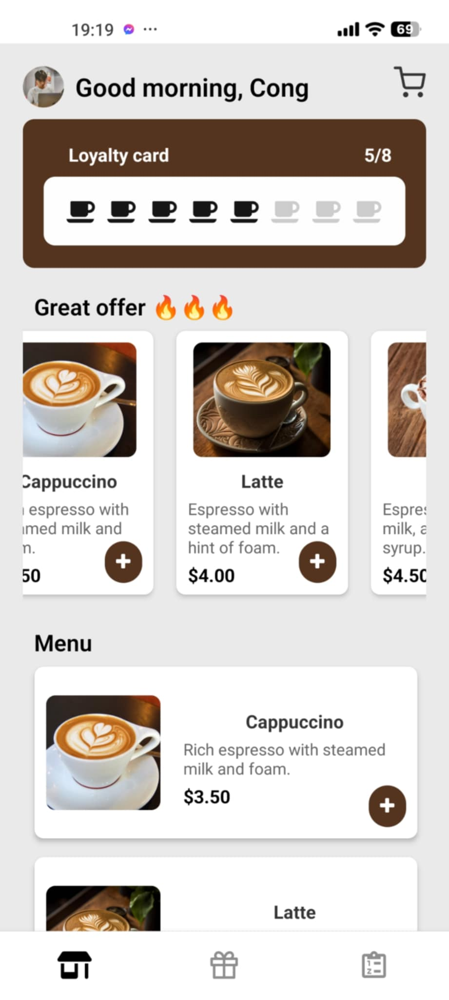
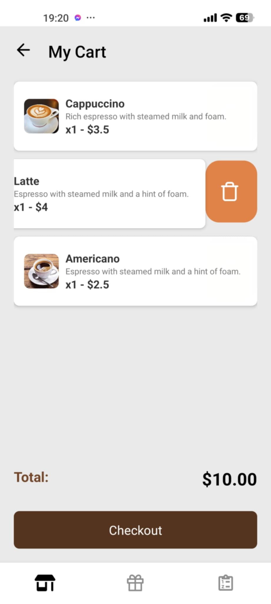
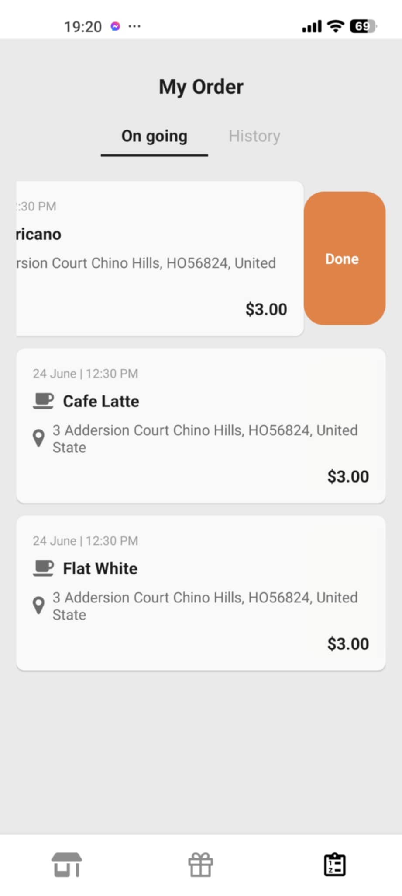

# Coffee Order App

**Coffee Order App** is a mobile application designed to make coffee ordering easy and convenient.  
Currently, the app includes only the user interface (UI) and does not have backend integration.

## 🚀 Key Features

- **Product List**: Browse a wide variety of beverages and snacks.  
- **Product Details**: View detailed information about each product, including images, prices, and descriptions.  
- **Order Placement**: Add products to the cart and proceed to place an order.  
- **Shopping Cart**: Manage products in the cart: add, remove, or adjust quantities.  
- **User Profile**: Manage personal information, including name, delivery address, and contact details.  
- **Order History**: Review past orders.  
- **Rewards**: Earn points from orders to redeem gifts or discounts.  

## 🛠️ Technologies Used

- **React Native**: For building the user interface.  
- **UI Kitten**: A customizable and beautiful UI library.  
- **React Navigation**: For seamless navigation between screens.  

## 📂 Project Structure

```plaintext
📦CoffeeTime
 ┣ 📂src
 ┃ ┣ 📂components       # Shared UI components
 ┃ ┣ 📂screens          # Main app screens
 ┃ ┣ 📂assets           # Images and other resources
 ┃ ┣ 📂constants        # Fixed values (colors, fonts, etc.)
 ┃ ┗ 📂utils            # Utility functions
 ┣ 📜App.js             # App entry point
 ┣ 📜package.json       # Project dependencies
 ┗ 📜README.md          # Project documentation
```

## 🌟 How to Run the App

To run this app, follow these steps:

### Clone the Repository
```bash
git clone https://github.com/nccongg/CoffeeTime.git
cd CoffeeTime
```
### Install Dependencies
```bash
npm install
```
### Start the App with Expo
```bash
npx expo start
```
### Run on Device or Emulator
- Scan the QR code with the Expo Go app on your phone.
- Alternatively, run it on an Android/iOS emulator.

## 📱 Download the App
The app is available for download here: <a href="https://expo.dev/artifacts/eas/3vC13BNBh9ckf3bC7EaqaA.apk">Download here</a>

## 📸 Screenshots

### Product List Screen  


### Shopping Cart Screen  


### Order History Screen  


## 🤝 Contribution

Contributions are welcome!  
If you'd like to contribute, feel free to open an **issue** or submit a **pull request**.

